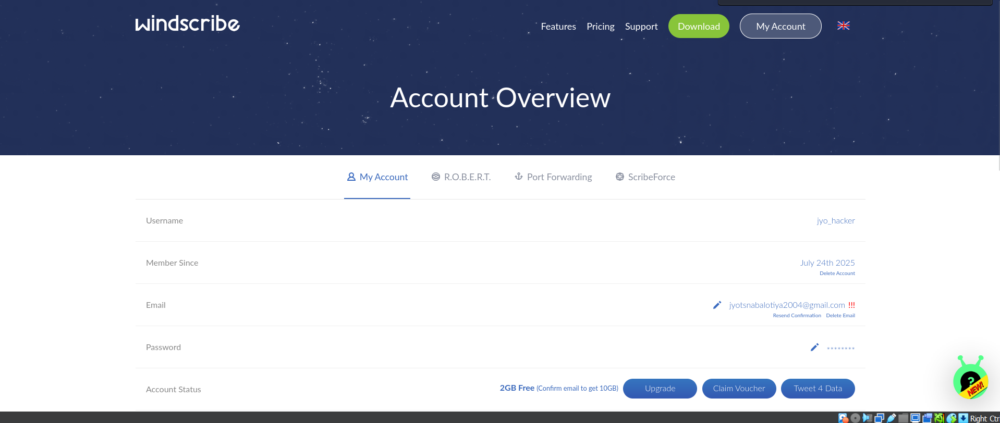
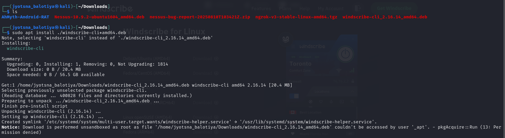
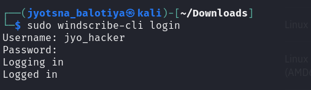
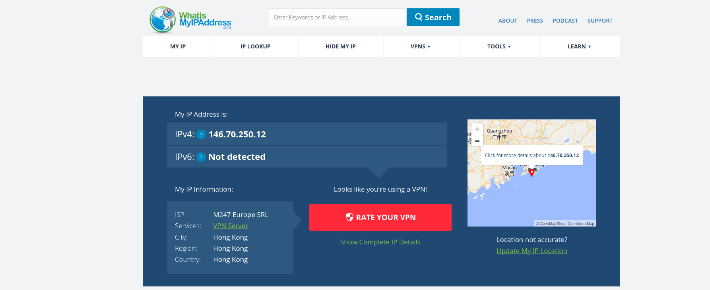
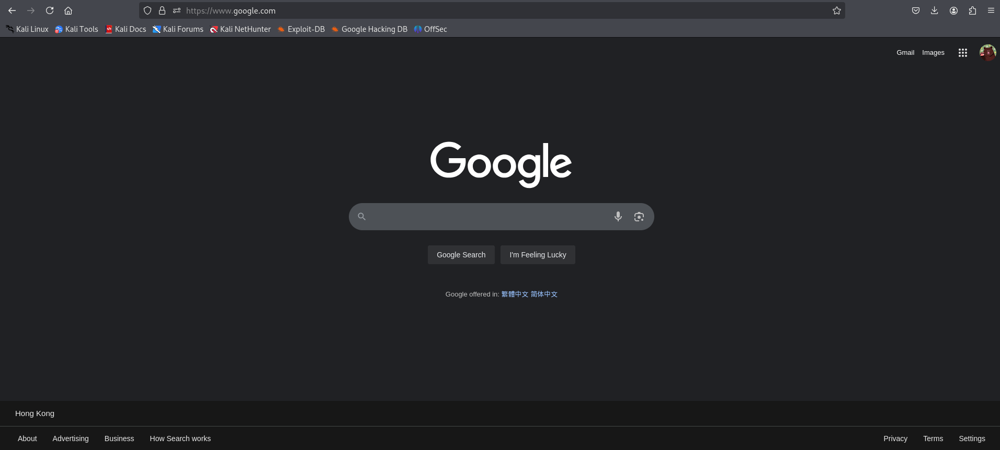

# CyberSecurity_Task_8
#  Working with VPNs

##  Overview
Windscribe is a powerful VPN service that helps you browse securely and privately. This guide demonstrates how to **install, configure, and connect Windscribe VPN on Windows**, verify IP change, compare speed, and analyze encryption and privacy features.

---

##  Steps Performed

### 1. Download and Install Windscribe
- Go to the [Windscribe Official Website](https://windscribe.com/download).
- Download the **Windows installer** and run the setup.

---

### 2. Launch Windscribe Application
- After installation, open the Windscribe application from the **Start Menu** or **Desktop Shortcut**.

---

### 3. Log in to Your Account
- Enter your **username and password** (or sign up if you don’t have an account).

---

### 4. Connect to a VPN Server
- Select a **server location** from the list.
- Click **Connect**.

---

### 5. Successful Connection & Verify IP
- Once connected, the status will turn **green**, and your IP address will change.
- Verified IP using [whatismyipaddress.com] → Location showed **Hong Kong**.

---

### 6. Browse a Website
- Opened **Google.com** → Displayed **Hong Kong region**, confirming location change.

---

### 7. Disconnect VPN and Compare Speed/IP
- Click the **Power button** to disconnect the VPN.
- Compared:
  - **With VPN:** Speed was slightly slower, IP was from **Hong Kong**.
  - **Without VPN:** Speed improved, IP reverted to **original location**.

---

##  VPN Encryption & Privacy Features
- Windscribe uses:
  - **AES-256 bit encryption** (military-grade security)
  - **SHA-512 authentication**
- Supports protocols:
  - **OpenVPN** and **IKEv2**
- Privacy features:
  - **Kill Switch** (stops traffic if VPN drops)
  - **IP/DNS Leak Protection**
  - **Ad and Tracker Blocking**

---

##  Benefits of Using VPN
✔ Hides real IP and changes virtual location  
✔ Encrypts all traffic for security on public Wi-Fi  
✔ Protects against ISP tracking and geo-restrictions  
✔ Blocks ads and trackers  

---

##  Limitations of Free VPN
✖ Limited **10 GB/month data cap**  
✖ Speeds may be slower compared to paid plans  
✖ Some streaming platforms block VPN IPs  
✖ Free servers have limited locations  

---

##  Summary
Windscribe VPN successfully masked the real IP, provided encrypted browsing, and offered useful privacy features. The connection was stable, and IP verification confirmed location spoofing. However, free VPNs have limitations in speed and data usage. For full performance and unlimited data, premium plans are recommended.

